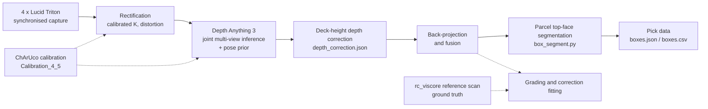

# MDE-Project

**Multi-Monocular Camera Depth Estimation Using Vision Foundation Models for Near Real-Time 3D Perception on Embedded Hardware**

Code archive for the MSc Robotics thesis of Naren Niranjan Pattanam Ravikumar, University of Twente, carried out as a graduation project at AWL-Techniek B.V., Harderwijk, the Netherlands.

| Role | Name |
|---|---|
| Author | Naren Niranjan Pattanam Ravikumar (MSc Robotics, UT) |
| Academic supervisor | dr.ir. Soheil Arastehfar (University of Twente) |
| Industrial supervisor | Erik Buit (AWL-Techniek) |

---

## Contents

1. [Overview](#overview)
2. [Research questions](#research-questions)
3. [System overview](#system-overview)
4. [Repository layout](#repository-layout)
5. [Final pipeline: `MDE/new/`](#final-pipeline-mdenew)
6. [Hardware](#hardware)
7. [Software setup](#software-setup)
8. [Reproducing the experiments](#reproducing-the-experiments)
9. [Outputs and file formats](#outputs-and-file-formats)
10. [Key findings reflected in the code](#key-findings-reflected-in-the-code)
11. [Known limitations](#known-limitations)
12. [Data availability](#data-availability)
13. [Citation](#citation)
14. [Acknowledgements and licences](#acknowledgements-and-licences)
15. [Contact](#contact)

---

## Overview

The project replaces a dedicated stereo or structured-light sensor with several ordinary monochrome-sensor GigE cameras and a monocular depth foundation model. Four Lucid Triton cameras are mounted above a conveyor in a FANUC robot cell (Station 6, AWL Experience Centre). Their synchronised frames are passed jointly to **Depth Anything 3** (DA3, checkpoint `depth-anything/da3nested-giant-large-1.1`), conditioned on the calibrated intrinsics and extrinsics of the rig. The per-view depth maps are corrected, back-projected and fused into one metric point cloud, from which parcel top faces are segmented to produce pick data (top-face centre, normal, in-plane orientation, footprint and height above the conveyor) for a 4 × 4 suction gripper.

Inference runs on an **NVIDIA Jetson AGX Thor**.

This repository contains the scripts, configuration files, calibration exports and small result tables needed to reproduce the experiments. Raw images, reference point clouds and run outputs (about 200 GB) are not included; see [Data availability](#data-availability).

## Research questions

| ID | Question | Where it is answered in the code |
|---|---|---|
| SRQ1 | Which vision foundation model is suited to multi-monocular metric depth in this cell? | `MDE/Moge2/`, `MultiCamera/`, early `MDE/DA3*/` folders |
| SRQ2 | What is the minimum viable camera count and arrangement? | `MDE/new/sweep_subsets.py`, `grade_subsets.py`, `rig_geometry.py`, `Comparison/` |
| SRQ3 | How does the pipeline perform on the embedded platform (per-stage processing time, processing rate, peak memory) against the cell's timing requirement? | `MDE/new/bench_pipeline.py`, `measure_acquisition.py`, `bench_*.csv` |

## System overview



The rig frame is the **center** camera frame, and all lengths inside the code are in metres unless a variable name says otherwise.

---

## Repository layout

The folders follow the chronological development of the work. The pipeline used for the thesis results is in **`MDE/new/`**, calibrated with **`Calibration_4_5/`**. Earlier folders are retained so that results reported in intermediate chapters and in the development history can be traced.

```
MDE-Project/
├── MDE/
│   ├── new/                 Final pipeline and all thesis experiments (SRQ2, SRQ3, ground truth, correction)
│   ├── stream_v3/           Last streaming iteration before MDE/new (depth field, layer alignment, soft segmentation)
│   ├── stream_v2/, stream/  Earlier live streaming versions; stream/ holds one example segmentation run
│   ├── improve/             Scan-referenced registration, correction and box grading
│   ├── DA3/                 First DA3 experiments and frozen requirements files
│   ├── DA3_v2 … DA3_v4/     Multi-view fusion iterations (pose prior / no pose prior / refined)
│   ├── DA3_4_1 … DA3_4_3/   Four-camera fusion, depth refinement and per-camera bias studies
│   ├── Moge2/               MoGe-2 multi-camera fusion (SRQ1 comparison)
│   └── harvest.py
├── MultiCamera/             MoGe-2 merge tools and a stereo-pair baseline
├── Comparison/              Camera-subset study tooling (coverage, GT extraction, grading, overlays)
├── Calibration_4_5/         Final four-camera ChArUco calibration (12 mm lenses)
├── Calibration_4_1/         Earlier four-camera calibration
├── Calibration, Calibration2…5, Calibration4/   Earlier calibration iterations (three and four cameras)
├── SingleCameraCalib/       Single-camera intrinsic calibration experiments
├── Image Capture*/, Image_Capture_4_*/          Arena SDK capture scripts, exposure and aperture tuning
├── README.md
└── .gitignore
```

### Folder guide

| Path | Status | Contents |
|---|---|---|
| `MDE/new/` | **Final** | Live and offline DA3 inference, subset sweeps and grading, ground-truth capture and alignment, correction fitting, per-stage benchmarking, parcel segmentation, thesis figure and table scripts. |
| `Calibration_4_5/` | **Final** | Automatic ChArUco capture, per-camera intrinsics, extrinsics relative to the center camera. Default calibration directory of `da3_stream.py`. |
| `MDE/stream_v3/` | Superseded | Four-DOF depth field (`depth_field.py`), per-frame online alignment, deck flatness, resolution sweep, segmentation of shrink-wrapped and non-planar tops (`soft_segment.py`). |
| `MDE/improve/` | Superseded | Scan registration (`scan_register.py`), scan-referenced correction (`scan_align.py`), cloud and box grading (`gt_compare.py`, `grade_boxes.py`). |
| `Comparison/` | Supporting | Tools for the SRQ2 subset study used before the study moved into `MDE/new/`: coverage, reference-scan extraction, projection and overlay checks, image quality, lens tagging. |
| `MDE/Moge2/`, `MultiCamera/Moge2/` | SRQ1 | MoGe-2 per-camera inference and multi-camera merging used in the model comparison. |
| `MDE/DA3*/` | Historical | Stepwise development of DA3 fusion: no-pose, intrinsics-only, refined, per-camera bias, plane separation. |
| `Calibration*/` (other) | Historical | Earlier calibration iterations, including those affected by camera desynchronisation. |
| `Image Capture*/` | Historical | Capture, exposure and aperture tuning scripts for the Triton cameras. |

---

## Final pipeline: `MDE/new/`

Most scripts share `rigkit.py` (calibration loading, projection, plane geometry) and import functions from `da3_stream.py`, so the offline, benchmark and ground-truth paths execute the same code as the live pipeline. Keep the files in one directory.

### Acquisition and inference

| Script | Purpose |
|---|---|
| `da3_stream.py` | Live four-camera acquisition, DA3 multi-view inference with calibrated intrinsics and extrinsics, depth correction, fusion and, on capture, parcel segmentation. Capture on key press, on scene settle, or continuously. |
| `da3_offline.py` | Runs the `da3_stream.py` pipeline on images from disk. Writes the same layout as a live capture. |
| `snap4.py` | One synchronised, full-resolution, unrectified frame per camera for the subset study. |
| `measure_acquisition.py` | Sustained frame-set rate of the four-camera rig and link payload accounting. |

### Camera-subset study (SRQ2)

| Script | Purpose |
|---|---|
| `rig_geometry.py` | Calibration-only analysis per subset: pose-prior conditioning, baselines, coverage. No inference. |
| `sweep_subsets.py` | Calls `da3_offline.py` once per camera subset and processing resolution, so DA3 solves each subset as its own joint problem. |
| `grade_subsets.py` | Scores every run against a reference cloud as height above the deck, `h_recon = p · h_gt + q`, with a frozen rigid registration. |
| `check_fusion.py`, `fix_upright_extrinsics.py`, `probe_gauge.py` | Diagnose and repair gauge and extrinsics of runs made without a pose prior or with inverted cameras. |
| `diff_arms.py`, `layer_audit.py`, `layer_probe.py`, `probe_band.py` | Decompose inter-view layering and height-band errors. |

### Ground truth and depth correction

| Script | Purpose |
|---|---|
| `capture_gt.py` | ChArUco reference captures through the production inference path, one run per board height. |
| `board_gt.py` | Deck standoff and plane separations from board images. |
| `depth_align.py` | Fits the per-view deck-height-linear correction against board poses and writes `depth_correction.json`. |
| `pin_markers.py` | Aligns the rc_viscore reference cloud to the rig frame using shared ArUco markers; writes `gt_align.json` and `marker_fit.json`. |
| `pin_alignment.py`, `check_alignment.py` | Conveyor-based alignment and verification that the reference deck sits on the belt plane. |
| `fit_correction.py` | Fits per-camera corrections against the reference cloud with a spatial hold-out. |
| `add_deployed_arm.py` | Patches `fit_correction.py` to also score the deployed `depth_correction.json` on the same held-out cells (`--write` applies the patch and keeps a `.bak`). |

### Parcel segmentation and pick data

| Script | Purpose |
|---|---|
| `box_segment.py` | Geometric segmentation of parcel top faces from the fused metric cloud: centre, normal, yaw, footprint, height, per-box quality. |
| `face_consensus.py` | Per-view reconciliation of top faces before the combined plane fit. |
| `box_geometry.py` | Exports cuboids, pick markers and axes as 3D geometry. |
| `box_scene.py` | Offline driver for segmentation on a stored capture. |

### Benchmarking (SRQ3)

| Script | Purpose |
|---|---|
| `bench_pipeline.py` | Per-stage timing (rectification, inference, back-projection), processing rate and peak GPU memory across camera count and processing resolution. |
| `probe_tensor_shapes.py`, `inspect_da3_api.py` | Network input shape per processing resolution and the DA3 API as loaded. |

### Thesis support scripts

`close_classA.py`, `makefig10.py`, `find_t68.py`, `t68_check*.py`, `roll_check.py` read existing result files and emit tables, figures or LaTeX fragments for specific thesis sections. They compute no new results.

### Configuration and result files

| File | Contents |
|---|---|
| `depth_correction.json` | Deployed correction, model `deck_height_linear`, lens `EO-58-001-12mm`, fitted at depth grid 420 × 504. |
| `depth_correction_fitted*.json`, `deployed_ltr*.json` | Corrections fitted against the reference cloud and hold-out scores of the deployed one. |
| `holdout_summary.md` | Comparison of the two hold-out regimes. |
| `gt_align.json`, `marker_fit.json`, `gt_tags.json`, `belt.json`, `belt_corners.json` | Reference-cloud registration, marker correspondences and conveyor frame. |
| `bench_prior.csv`, `bench_noprior.csv`, `bench_noprior_quad.csv` | SRQ3 benchmark tables. |
| `acquisition_report.md`, `acquisition_raw.json` | Acquisition rate measurements. |
| `gap_tables.tex` | LaTeX tables generated for the thesis. |
| `persist.json` | Arena SDK persisted stream settings per camera serial. |

---

## Hardware

| Component | Specification |
|---|---|
| Compute | NVIDIA Jetson AGX Thor Developer Kit, JetPack 7, CUDA 13, 128 GB unified memory |
| Cameras | 4 × Lucid Triton TRI050S-C (Sony IMX264, 2448 × 2048, 3.45 µm), GigE PoE |
| Lenses | Edmund Optics TECHSPEC C Series 12 mm f/1.8 (EO 58-001), calibrated at f/5.6 |
| Camera names | `left`, `center` (reference), `top`, `right`; serial mapping in `Calibration_4_5/config.py` |
| Working distance | About 3.16 m to the conveyor deck |
| Calibration target | ChArUco, 12 × 9 squares, 60 mm squares, 47 mm markers, `DICT_5X5_250`, legacy pattern |
| Ground truth | Roboception rc_viscore stereo sensor (reference only, not part of the pipeline) |
| Robot cell | FANUC robot, custom 4 × 4 suction gripper, AWL Station 6 |

Development and offline evaluation were also carried out on a Windows 11 laptop (RTX A2000 8 GB, WSL2).

---

## Software setup

### 1. Arena SDK

Camera access uses the Lucid Vision Labs Arena SDK and its Python bindings `arena_api`. Download the Linux ARM64 SDK from the [Lucid downloads hub](https://thinklucid.com/downloads-hub/) and install it following Lucid's instructions. The SDK is not redistributed here (`ArenaSDK/` is excluded by `.gitignore`).

The frozen requirements reference the wheel by a local path (`arena_api-2.8.4`). Install the wheel from your SDK download first, then remove or edit that line before installing the rest.

### 2. Python environment

The thesis runs used Python 3.10 in an environment named `da3`.

```bash
python3 -m venv ~/venvs/da3
source ~/venvs/da3/bin/activate

# PyTorch: on the Jetson, install the NVIDIA JetPack build from the Jetson index
# before anything else. On a desktop GPU, install the CUDA build from pytorch.org.

pip install /path/to/ArenaSDK/arena_api-2.8.4-py3-none-any.whl
pip install -r MDE/DA3/requirements_da3_new.txt   # after removing the arena-api line
pip install open3d
```

`MDE/DA3/requirements.txt` is the fuller freeze of the earlier DA3 environment and can be used as a reference if a package is missing. `requirements_da3_new.txt` does not list PyTorch or Open3D; install them separately as shown. `MDE/Moge2/requirements_moge2.txt` is empty in this archive; follow the installation instructions of the MoGe repository if the SRQ1 comparison is to be rerun.

### 3. Models

Upstream model code is not vendored.

```bash
git clone https://github.com/ByteDance-Seed/Depth-Anything-3 MDE/DA3/depth-anything-3
pip install -e MDE/DA3/depth-anything-3

# SRQ1 comparison only
git clone https://github.com/microsoft/MoGe MDE/Moge2/MoGe
```

The DA3 checkpoint `depth-anything/da3nested-giant-large-1.1` is downloaded from Hugging Face on first use.

### 4. Network

The cameras require jumbo frames and a static link configuration on the Jetson interface. `Calibration/setup_network.sh` contains the configuration used for the earlier rig; adapt the interface name and addresses to your setup.

### 5. Paths

Several scripts carry absolute default paths from the development machine (for example `/home/jetson/Projects/Calibration_4_5/results`). Pass `--calib-dir` (or `--calib`) explicitly when working from a different location.

---

## Reproducing the experiments

Commands are run from `MDE/new/` with the `da3` environment active unless stated otherwise. Every script accepts `--help`, and most write a diagnostic JSON beside their outputs.

### Step 1: Calibrate the cameras

```bash
cd Calibration_4_5
python auto_capture.py --mode focus           # once after any lens change or refocus
python auto_capture.py --mode intrinsics      # per-camera ChArUco views, quality-gated
python calibrate_intrinsics.py
python auto_capture.py --mode extrinsics      # synchronised views, all cameras together
python calibrate_extrinsics.py
```

Board geometry, camera serials, exposure and lens data are set in `config.py`. Results are written to `Calibration_4_5/results/`, and each record carries a `lens_id` that the streamer checks before running. Exposure and gain must be fixed during calibration, and the extrinsic captures must be hardware-synchronised: desynchronised frames were the cause of the poor extrinsic residuals in earlier calibration folders.

### Step 2: Live operation

```bash
python da3_stream.py --calib-dir ../../Calibration_4_5/results \
    --correction depth_correction.json --process-res 504
```

Defaults: cameras `left center right top`, reference `center`, model `da3nested-giant-large-1.1`, mode `prior` (calibrated extrinsics supplied as pose prior), union fusion, capture on key press (`--capture-trigger settle` captures when the scene has stopped moving). Each capture writes depth, confidence, K, E, the fused cloud and, unless `--no-segment` is passed, `boxes.json` and `boxes.csv`.

### Step 3: Capture a scene for offline work

```bash
python snap4.py --out captures/scene_a
```

### Step 4: Offline inference

```bash
python da3_offline.py --images captures/scene_a \
    --cameras center left top right --out-dir runs_da3/scene_a/quad \
    --pose-prior always
```

Arguments not consumed by `da3_offline.py` (for example `--calib-dir`, `--process-res`) are passed through to the `da3_stream.py` parser. Run once per subset; DA3 solves the supplied frames jointly, so slicing a four-camera run afterwards does not reproduce a two-camera run. Use `--probe` first to check symbol resolution without loading the model.

### Step 5: Camera-subset study (SRQ2)

```bash
python rig_geometry.py --calib ../../Calibration_4_5/results
python sweep_subsets.py --images captures/scene_a --out-root runs_da3/scene_a --res 504 700 1008
python pin_markers.py --gt gt/<reference_cloud>.ply \
    --run runs_da3/scene_a/center+left+top+right_res1008 --belt-corners belt_corners.json --dict auto
python grade_subsets.py --gt gt/<reference_cloud>.ply --belt belt.json \
    --runs-root runs_da3/scene_a --align-from runs_da3/scene_a/center+left+top+right_res1008 \
    --out grades/scene_a
```

`sweep_subsets.py` defaults to `--pose-prior never` so that every subset is run under the same conditioning; DA3's Sim(3) pose alignment needs at least three non-collinear camera centres, which single cameras and pairs cannot provide. Run a second sweep with `--pose-prior always` over the subsets that can carry it and compare the two. The sweep runs uncorrected, because `depth_correction.json` is only valid at the grid it was fitted on.

### Step 6: Ground truth and depth correction

```bash
# Board-referenced correction, one run per board height
python capture_gt.py --label deck   --nominal-mm 0   --out-dir runs/gt_deck
python capture_gt.py --label riser1 --nominal-mm 130 --out-dir runs/gt_riser1
python capture_gt.py --label riser  --nominal-mm 218 --out-dir runs/gt_riser
python depth_align.py --run runs/gt_deck --run runs/gt_riser1 --run runs/gt_riser --out depth_correction.json

# Reference-cloud correction with spatial hold-out
python fit_correction.py --gt gt/<reference_cloud>.ply --align gt_align.json --belt belt.json \
    --run runs_da3/cfg1008/center+left+top+right_res1008 --out depth_correction_fitted.json
```

### Step 7: Embedded benchmark (SRQ3)

```bash
python bench_pipeline.py --images captures/scene_a \
    --res 504 700 1008 1512 --all-subsets --repeats 10 --out bench.csv
python measure_acquisition.py --seconds 60
```

The model is loaded once, frames are held in memory, every configuration is warmed up, and timing uses `time.perf_counter()` with CUDA synchronisation. Peak GPU memory is reset per configuration, and out-of-memory failures are recorded as rows.

---

## Outputs and file formats

A capture or offline run directory contains:

| File | Contents |
|---|---|
| `depth_<cam>.npy` | Corrected metric depth (m) on the DA3 output grid |
| `depth_raw_<cam>.npy` | Depth before correction |
| `conf_<cam>.npy` | DA3 confidence |
| `K_<cam>.npy`, `E_<cam>.npy` | Intrinsics at the output grid and camera-to-rig extrinsics |
| `proc_<cam>.png` | Rectified image as seen by DA3 |
| `fused.ply`, `cloud_<cam>.ply` | Fused and per-view point clouds |
| `boxes.json`, `boxes.csv` | Parcel pick data and per-box quality record |
| `capture.json` | Settings, timing and diagnostics of the capture |

`MDE/stream/segmentation_runs/live_20260810_162205/` is a small example of a live run in this layout.

---

## Key findings reflected in the code

These findings determine several defaults and checks in the scripts. Full results and discussion are in the thesis.

- **Pose prior and intrinsics.** DA3 disregards supplied intrinsics unless a pose prior is supplied as well. The live pipeline therefore defaults to `--mode prior`, and scale claims from intrinsics-only runs are treated as unreliable.
- **Model selection (SRQ1).** DA3 was selected over MoGe-2 because it supports native multi-view inference with camera conditioning.
- **Calibration.** Extrinsic reprojection error dropped from about 275 px to 0.33 px once hardware desynchronisation, not board geometry, was identified as the cause.
- **Error structure.** The dominant error is a loss of relief (a rise `h` is reconstructed as roughly `0.85 h`), and 62 to 93 % of the capture-to-capture error is common to all views within a capture. Inter-view consistency is therefore a necessary but not a sufficient accuracy check, and grading is done against an independent reference cloud.
- **Camera count (SRQ2).** Additional cameras increase coverage of the conveyor but do not lower the per-view accuracy floor set by the model.
- **Embedded performance (SRQ3).** With four cameras at processing resolution 504 and the pose prior, `bench_prior.csv` records 1123 ms total per frame set (858 ms inference, 82 ms rectification, 183 ms back-projection), 0.89 frame sets per second and 8.2 GB peak GPU memory on the Jetson AGX Thor.

## Known limitations

- The deck-height-linear correction is valid only within the height band in which it was fitted and must be clamped outside it.
- On held-out belt geometry the deployed correction does not reduce the error: `holdout_summary.md` records a held-out RMS of 148 to 240 mm before correction and a change of −10.1 to +14.7 mm after it, worse in 8 of 10 camera-runs, compared with 15.8 to 37.0 mm on the board planes it was fitted against.
- A correction file is tied to one lens, processing resolution and depth grid; the streamer refuses mismatched `lens_id` records.
- Several folders contain near-identical copies of shared modules (`box_segment.py`, `da3_stream.py`, `rigkit.py`) from different stages of the work. Use the copies in `MDE/new/`.
- Hard-coded absolute paths from the Jetson remain in defaults and docstrings.
- The code was written for one cell and one camera arrangement and has not been packaged as a library.

---

## Data availability

Raw captures, calibration image sets, rc_viscore reference clouds and run outputs total about 200 GB and are excluded through `.gitignore`. They are archived at AWL-Techniek and can be made available on request, subject to approval by AWL-Techniek, by contacting the author.

## Citation

```bibtex
@mastersthesis{pattanamravikumar2026mde,
  author = {Pattanam Ravikumar, Naren Niranjan},
  title  = {Multi-Monocular Camera Depth Estimation Using Vision Foundation Models
            for Near Real-Time 3D Perception on Embedded Hardware},
  school = {University of Twente},
  address = {Enschede, the Netherlands},
  year   = {2026},
  type   = {MSc thesis}
}
```

## Acknowledgements and licences

This work was carried out at AWL-Techniek B.V. The author thanks dr.ir. Soheil Arastehfar and Erik Buit for supervision, and Luka for technical support on the workcell hardware.

Third-party software is used under its own licence and is not redistributed here:

- [Depth Anything 3](https://github.com/ByteDance-Seed/Depth-Anything-3), ByteDance Seed
- [MoGe / MoGe-2](https://github.com/microsoft/MoGe), Microsoft Research
- [Arena SDK](https://thinklucid.com/downloads-hub/), Lucid Vision Labs
- OpenCV, Open3D, NumPy, SciPy, PyTorch

No licence has been specified for the code in this repository. Contact the author before reuse.

## Contact

Naren Niranjan Pattanam Ravikumar, awlniranjan@gmail.com
